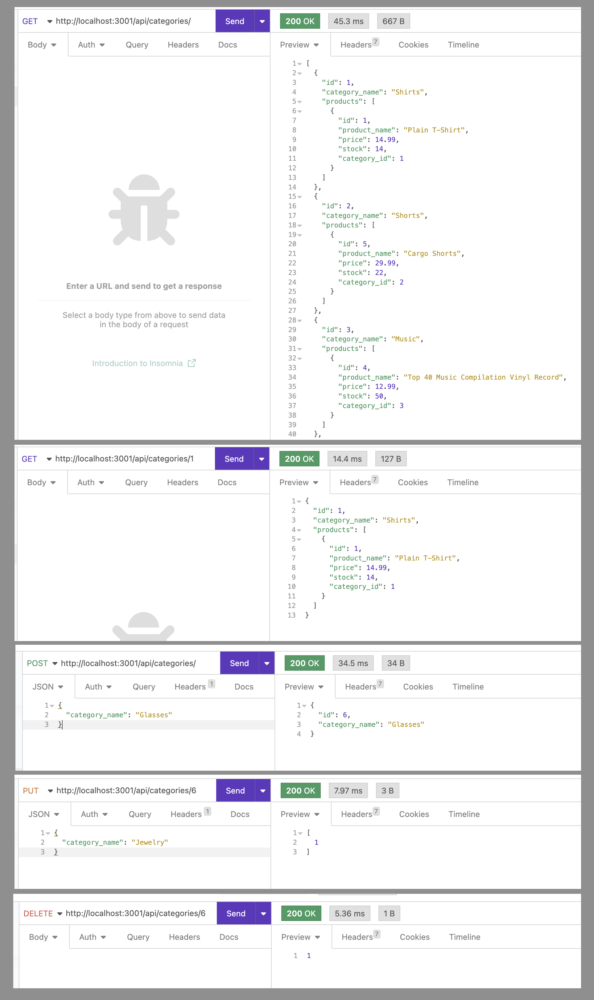
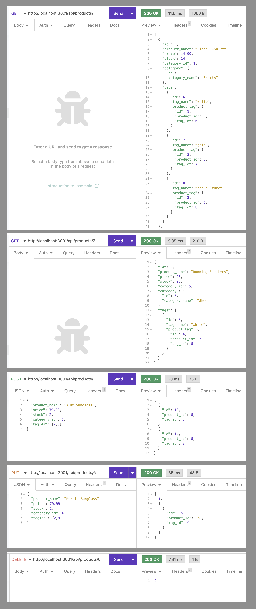
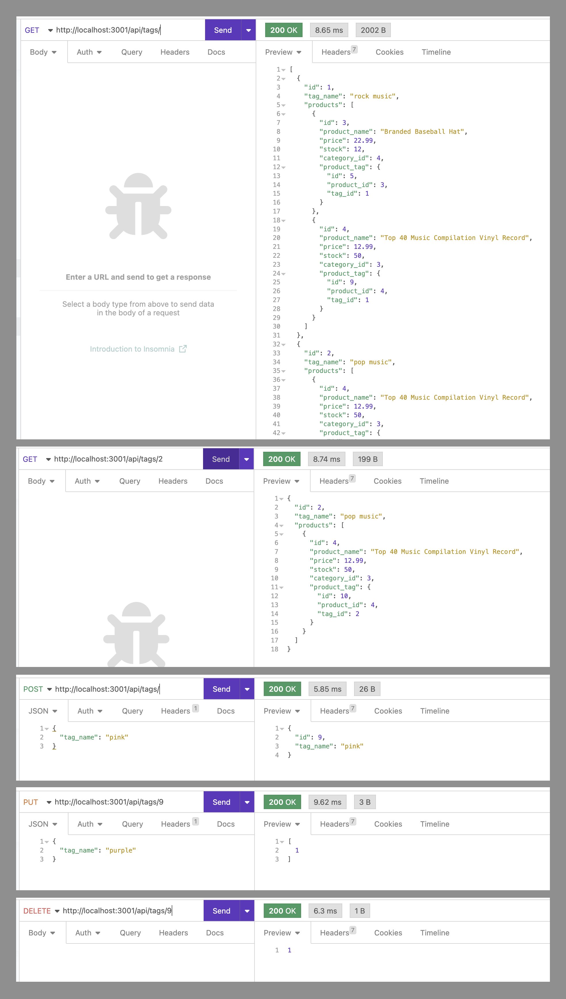

# Module 13 Challenge - Object-Relational Mapping (ORM): E-Commerce Back End

>**Application Video:** [E-Commerce Back End](https://drive.google.com/file/d/15B7pzX4bBsVOQAwEAcHQQRmwDwZ9Svu5/view)
>
>**View:** [Description](#description) / [Application Details](#application-details) / [Application Sample Runs](#application-sample-runs)
>
>**Application Preview:**
>
>
> 
## **DESCRIPTION**
> Topic Assessed: **sequelize** - **sequelize get, post, put, delete API Requests, sequelize Models, dotenv connection, etc.**
### **My Task**
*E-Commerce Back End* allows a user to add, pull, update, and delete information from the database using sequelize.
> Modify starter code.
> 
> Complete the database models with the defined requirements listed for each model.
>
> Execute association methods on the models to create relationships .
>
> Complete the API routes to Perform RESTful CRUD Operations.
>
> Sync Sequelize to the Database on Server Start.
> 
## User Story
```
AS A manager at an internet retail company
I WANT a back end for my e-commerce website that uses the latest technologies
SO THAT my company can compete with other e-commerce companies
```
## Acceptance Criteria
```
GIVEN a functional Express.js API
WHEN I add my database name, MySQL username, and MySQL password to an environment variable file
THEN I am able to connect to a database using Sequelize
WHEN I enter schema and seed commands
THEN a development database is created and is seeded with test data
WHEN I enter the command to invoke the application
THEN my server is started and the Sequelize models are synced to the MySQL database
WHEN I open API GET routes in Insomnia for categories, products, or tags
THEN the data for each of these routes is displayed in a formatted JSON
WHEN I test API POST, PUT, and DELETE routes in Insomnia
THEN I am able to successfully create, update, and delete data in my database
```
## **APPLICATION DETAILS**

### server.js Information
* **require**: Defined external and local packages used.
  * `express`, `routes`, `sequelize`
* **port**: Defined the default port as 3001
* **sequelize**: Synced sequelize models to the database and launched the server.

### models Information
* **Category.js**:
  * `id`: integer, not null, primary key, auto-increment 
  * `category_name`: string, not null
* **Product.js**: 
  * `id`: integer, not null, primary key, auto-increment 
  * `product_name`: string, not null
  * `price`: decimal (precision 10, 2 decimal places), not null, validate decimal 
  * `stock`: integer, not null, default value 10, validate numeric
  * `category_id`: integer, references category_id, not unique
* **Tag.js**: 
  * `id`: integer, not null, primary key, auto-increment 
  * `tag_name`: string, not null
* **ProductTag.js**: 
  * `id`: integer, not null, primary key, auto-increment 
  * `product_id`: integer, references product_id, not unique
  * `tag_id`: integer, references tag_id, not unique
* **index.js**: 
  * `Product belongsTo Category`: foreignKey category_id
  * `Category hasMany Product`: foreignKey category_id, cascade on delete
  * `Product belongsToMany Tag` through ProductTag, not unique, as 'tags'
    * foreignKey product_id
  * `Tag belongsToMany Product` through ProductTag, not unique, as 'products'
    * foreignKey tag_id

### routes api Information
* **category-routes.js**: `async/await` get, get by id, post, put, and delete requests.
  * `get`/`get by id`: include [{ model: Product }]
* **product-routes.js**: `async/await` get, get by id, post, put, and delete requests.
  * `get`/`get by id`: include [{ model: Category }, { model: Tag, through: ProductTag, as: 'tags' }]
  * `post`: create/bulkCreate array of tagIds 
  * `put`: find associated tagIds, filter and create unique array of tadIds, destroy/bulkCreate new array of tagIds
* **tag-routes.js**: `async/await` get, get by id, post, put, and delete requests.
  * `get`/`get by id`: include [{ model: Product, through: ProductTag, as: 'products' }] 
* **index.js**: Define route of api requests.

### package.json Information
* **package**: Define the dependencies/packages used in the application.
  * Dependencies: 
    * [dotenv](https://www.npmjs.com/package/dotenv), version ^8.2.0
    * [express](https://www.npmjs.com/package/express), version ^4.17.1
    * [mysql2](https://www.npmjs.com/package/mysql), version ^2.1.0
    * [sequelize](https://www.npmjs.com/package/sequelize), version ^5.21.7
  * devDependencies:
    * [nodemon](https://www.npmjs.com/package/nodemon), version ^2.0.3

## **APPLICATION SAMPLE RUNS**
### Categories Requests
>
>
### Products Requests
>
>
### Tags Requests
>